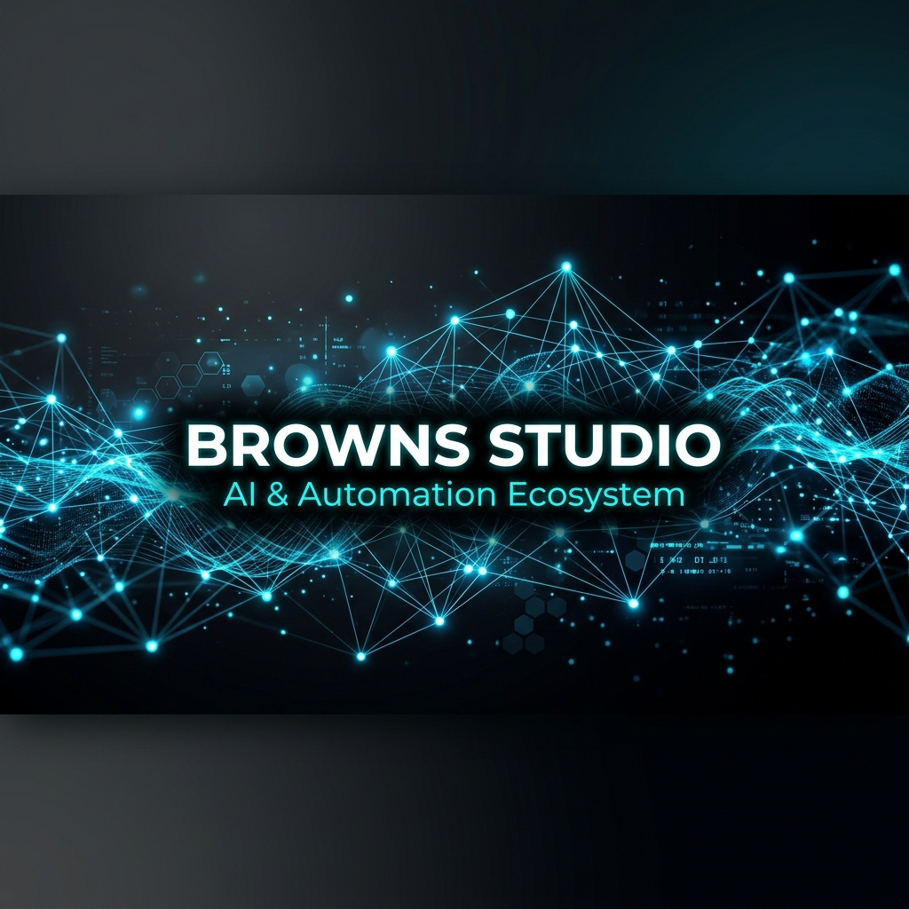
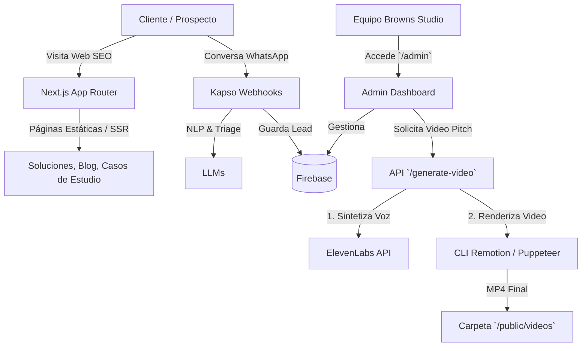
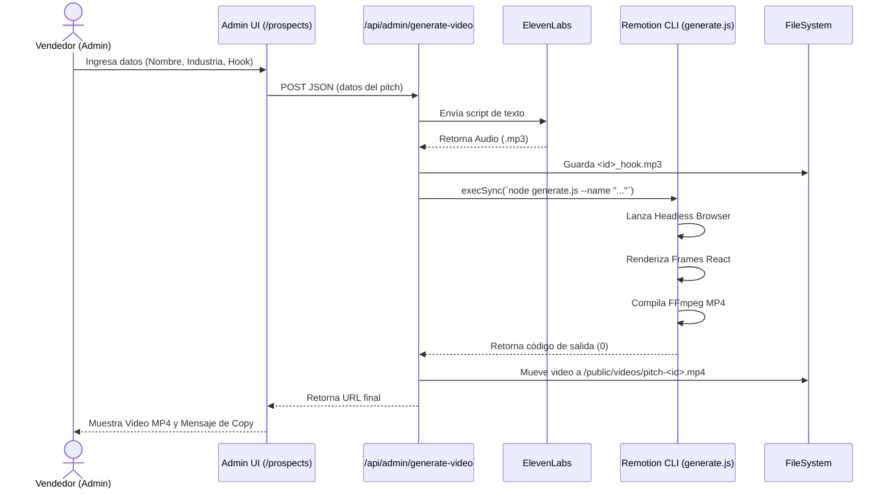

<p align="center">
  
</p>

# Browns Studio - AI & Automation Ecosystem

> Repositorio principal de Browns Studio. Plataforma integral que combina landing pages SEO, panel de control interno, automatización de WhatsApp, y un motor avanzado de prospección B2B usando síntesis de voz (ElevenLabs) y renderizado de video programático (Remotion).
>
> **Nota de uso:** Este documento está orientado exclusivamente al equipo de desarrollo y soporte interno. No exponer llaves ni credenciales reales en la documentación.

---

## 🛠 Tech Stack

### Core
- **Framework:** Next.js 15+ (App Router, Turbopack)
- **Lenguaje:** TypeScript
- **Estilos:** Tailwind CSS + Framer Motion (Animaciones complejas y micro-interacciones)
- **Despliegue:** Vercel

### IA & Media
- **Voz:** ElevenLabs API (Síntesis Text-to-Speech hiperrealista)
- **Video:** Remotion (Generación dinámica de videos en React + Node `child_process`)
- **LLMs:** Integraciones nativas con GPT-4 / Claude (Vía prompts de `generator`)

### Backend & Integraciones
- **Base de Datos:** Firebase Firestore (Almacenamiento de Leads, Videos, Embudos de conversión)
- **Mensajería Autónoma:** Kapso (Webhooks y workflows visuales para flujos de WhatsApp B2B)
- **Módulo Legal (JurisClaro AI):** Módulo interno para seguimiento e interpretación de causas judiciales (PJUD) a lenguaje humano.

---

## 🏗 Arquitectura del Sistema

El proyecto está diseñado de forma modular. La web pública sirve como motor de indexación (SEO/GEO) y embudo, mientras que el `/admin` condensa las lógicas de automatización pesadas.



---

## 🎬 Flujo Detallado: Generador de Video (Remotion)

Nuestra principal herramienta de *Outbound* es la generación de demostraciones visuales personalizadas. 
El flujo ocurre en la ruta `app/api/admin/generate-video`.



---

## 📂 Estructura Principal del Repositorio

```text
/
├── app/
│   ├── [locale]/             # Páginas Públicas Internacionalizadas (es, en, pt)
│   │   ├── casos-de-estudio/ # Motor GEO (Blog de casos)
│   │   ├── soluciones/       # Landing pages dinámicas por nicho (SEO)
│   │   └── ...
│   ├── admin/                # Panel privado de agencia (CRM, Generator, Prospects)
│   └── api/                  # Endpoints (Video Generator, Webhooks, Auth)
├── components/               # Componentes Reutilizables de UI
├── lib/                      # Configuración, db (Firebase client), datos duros (JSON)
├── public/                   # Assets, imágenes y videos (incluyendo pitches renderizados)
├── video-generator/          # ⚠️ CORE: Archivos y scripts base de Remotion
└── .kapso/                   # Configuraciones de workflows y agentes de WhatsApp
```

---

## ⚙️ Desarrollo Local (Local Setup)

### Requisitos Previos
- Node.js 18+
- pnpm instalado (`npm install -g pnpm`)
- FFMPEG instalado (Requerido localmente por Remotion para renderizar video)

### Pasos

1. **Clonar e instalar dependencias:**
   ```bash
   git clone <repo_url>
   cd BrownsStudio
   pnpm install
   ```

2. **Variables de Entorno:**
   Duplica el archivo `.env.local.example` y renómbralo a `.env.local`.
   Solicita las credenciales internas al administrador de la agencia. Las llaves más críticas son:
   - `ELEVENLABS_API_KEY`: Fundamental para que `/admin/prospects` genere locuciones.
   - `NEXT_PUBLIC_FIREBASE_...`: Para conexión a base de datos.
   
3. **Iniciar servidor en modo desarrollo:**
   ```bash
   pnpm run dev
   ```
   El sitio estará disponible en `http://localhost:3000`.

### Consideraciones al compilar Video (Remotion)
Para que el motor de `video-generator` funcione localmente, asegúrate de no modificar las rutas ocultas (obfuscadas en el archivo `route.ts`) a menos que cambies el directorio base de remotion. El sistema hace fallback a audios pre-grabados si no detecta la API Key de ElevenLabs.
