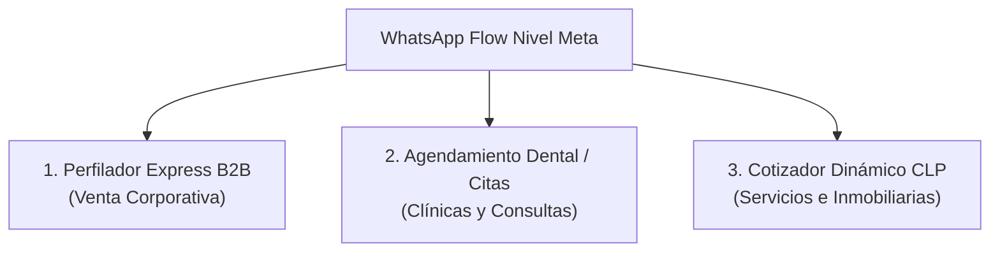

# 📲 Guía Maestra de WhatsApp Flows Premium B2B — Browns Studio
   
Los **WhatsApp Flows** (Flujos de WhatsApp) son pantallas de formularios interactivos y visuales que se abren de forma nativa **dentro** de WhatsApp, sin que el usuario tenga que salir de la aplicación. 

Tienen tasas de conversión de hasta **3x mayores** que los chatbots tradicionales de texto, ya que eliminan toda la fricción de escribir mensajes uno por uno.

Esta guía técnica y comercial te permitirá:
1. Explicar el valor comercial de los Flows a tus clientes de alto presupuesto.
2. Copiar y pegar los **3 esquemas de diseño JSON (Layout Schemas)** listos para registrar en la Consola de Desarrolladores de Meta.

---

## 💎 Los 3 Blueprints de WhatsApp Flows Más Rentables



---

## 📋 BLUEPRINT 1: Perfilador Express B2B (Lead Triage Flow)
* **Objetivo**: Calificar un lead de servicios/B2B en 15 segundos antes de enviarlo a CRM o Sheets.
* **Campos incluidos**: Nombre, Sitio Web, Rubro, Presupuesto Estimado y Cuello de Botella Operativo.

### 🛠️ Código JSON del Flow (Layout Schema de Meta)
Copia y pega este JSON en el editor de Flows de la Consola de Meta:

```json
{
  "version": "3.0",
  "screens": [
    {
      "id": "B2B_TRIAGE",
      "title": "Perfilado de Negocio",
      "layout": {
        "type": "SingleColumnLayout",
        "children": [
          {
            "type": "TextHeading",
            "text": "Cuéntanos sobre tu Negocio 🚀"
          },
          {
            "type": "TextBody",
            "text": "Completa estos datos rápidos para diseñar tu propuesta agéntica a medida."
          },
          {
            "type": "TextInput",
            "name": "full_name",
            "label": "Tu Nombre Completo",
            "required": true
          },
          {
            "type": "TextInput",
            "name": "business_name",
            "label": "Nombre de tu Empresa / Sitio Web",
            "required": true
          },
          {
            "type": "Dropdown",
            "name": "business_type",
            "label": "Rubro del Negocio",
            "required": true,
            "options": [
              { "id": "salud", "title": "Clínicas y Salud" },
              { "id": "inmobiliario", "title": "Inmobiliario / Construcción" },
              { "id": "ecommerce", "title": "E-commerce y Retail" },
              { "id": "servicios", "title": "Agencias B2B y Servicios" },
              { "id": "otro", "title": "Otros Sectores" }
            ]
          },
          {
            "type": "Dropdown",
            "name": "budget_range",
            "label": "Presupuesto de Inversión",
            "required": true,
            "options": [
              { "id": "starter", "title": "Menos de $750.000 CLP" },
              { "id": "pro", "title": "$750.000 a $1.500.000 CLP" },
              { "id": "enterprise", "title": "Más de $1.500.000 CLP" }
            ]
          },
          {
            "type": "TextArea",
            "name": "pain_point",
            "label": "¿Cuál es tu principal cuello de botella operativo hoy?",
            "required": false
          },
          {
            "type": "Footer",
            "label": "Enviar Datos y Calificar",
            "on-click-action": {
              "name": "complete",
              "payload": {
                "full_name": "${data.full_name}",
                "business_name": "${data.business_name}",
                "business_type": "${data.business_type}",
                "budget_range": "${data.budget_range}",
                "pain_point": "${data.pain_point}"
              }
            }
          }
        ]
      }
    }
  ]
}
```

---

## 📅 BLUEPRINT 2: Agendamiento Clínico y Dental (Booking Flow)
* **Objetivo**: Permitir al paciente elegir sucursal, especialidad dental, fecha y bloque horario en 3 clics.
* **Campos incluidos**: Sucursal, Especialidad, Fecha de Atención y Bloque Horario preferido.

### 🛠️ Código JSON del Flow (Layout Schema de Meta)

```json
{
  "version": "3.0",
  "screens": [
    {
      "id": "BOOKING_CLINIC",
      "title": "Reservar Hora de Evaluación",
      "layout": {
        "type": "SingleColumnLayout",
        "children": [
          {
            "type": "TextHeading",
            "text": "Elige tu Cita Médica 🩺"
          },
          {
            "type": "Dropdown",
            "name": "sucursal",
            "label": "Selecciona la Sede",
            "required": true,
            "options": [
              { "id": "providencia", "title": "Sede Providencia (Metro Tobalaba)" },
              { "id": "las_condes", "title": "Sede Las Condes (Apumanque)" }
            ]
          },
          {
            "type": "Dropdown",
            "name": "especialidad",
            "label": "Especialidad Requerida",
            "required": true,
            "options": [
              { "id": "evaluacion", "title": "Evaluación Dental General (TAC gratis)" },
              { "id": "limpieza", "title": "Limpieza Profiláctica Ultrasonido" },
              { "id": "implantes", "title": "Diseño de Sonrisa / Implantes" },
              { "id": "urgencia", "title": "Urgencia Odontológica Activa" }
            ]
          },
          {
            "type": "DatePicker",
            "name": "fecha_cita",
            "label": "Fecha Preferida de Atención",
            "required": true
          },
          {
            "type": "RadioButtons",
            "name": "horario_bloque",
            "label": "Bloque Horario de Preferencia",
            "required": true,
            "options": [
              { "id": "manana", "title": "Bloque Mañana (09:00 a 13:00 hrs)" },
              { "id": "tarde", "title": "Bloque Tarde (14:00 a 19:00 hrs)" }
            ]
          },
          {
            "type": "Footer",
            "label": "Confirmar Pre-Reserva",
            "on-click-action": {
              "name": "complete",
              "payload": {
                "sucursal": "${data.sucursal}",
                "especialidad": "${data.especialidad}",
                "fecha_cita": "${data.fecha_cita}",
                "horario_bloque": "${data.horario_bloque}"
              }
            }
          }
        ]
      }
    }
  ]
}
```

---

## 💸 BLUEPRINT 3: Cotizador Dinámico CLP (Calculator Flow)
* **Objetivo**: Permitir al prospecto cotizar en vivo agregando módulos de automatización y ver una proyección estimada antes de agendar.
* **Campos incluidos**: Nombre del módulo principal, integraciones requeridas y volumen mensual.

### 🛠️ Código JSON del Flow (Layout Schema de Meta)

```json
{
  "version": "3.0",
  "screens": [
    {
      "id": "QUOTE_CALCULATOR",
      "title": "Calculador de Proyectos IA",
      "layout": {
        "type": "SingleColumnLayout",
        "children": [
          {
            "type": "TextHeading",
            "text": "Cotiza tu Agente Comercial en Vivo 📊"
          },
          {
            "type": "CheckboxGroup",
            "name": "modulos",
            "label": "Selecciona los Módulos Requeridos",
            "required": true,
            "options": [
              { "id": "triage", "title": "Calificación Conversacional 24/7" },
              { "id": "audio", "title": "Procesamiento de Audios de Voz" },
              { "id": "crm", "title": "Integración Bidireccional con HubSpot/CRM" },
              { "id": "sheets", "title": "Sincronización a Google Sheets" }
            ]
          },
          {
            "type": "Dropdown",
            "name": "leads_volumen",
            "label": "Volumen Mensual Proyectado",
            "required": true,
            "options": [
              { "id": "bajo", "title": "Menos de 100 conversaciones/mes" },
              { "id": "medio", "title": "100 a 500 conversaciones/mes" },
              { "id": "alto", "title": "Más de 500 conversaciones/mes" }
            ]
          },
          {
            "type": "TextInput",
            "name": "email_contacto",
            "label": "Tu Correo Electrónico Corporativo",
            "required": true
          },
          {
            "type": "Footer",
            "label": "Calcular Cotización Express",
            "on-click-action": {
              "name": "complete",
              "payload": {
                "modulos": "${data.modulos}",
                "leads_volumen": "${data.leads_volumen}",
                "email_contacto": "${data.email_contacto}"
              }
            }
          }
        ]
      }
    }
  ]
}
```

---

## ⚡ Cómo Integrar y Disparar los Flows en tu Lógica de Next.js

Para gatillar y enviar estos flujos de forma nativa a tus clientes de WhatsApp, solo debes usar la función `sendFlowMessage` de `lib/whatsapp/client.ts` dentro de tu lógica de conversión (Fase 1 o 2).

### Ejemplo de Implementación en tu controlador:
```typescript
import { sendFlowMessage } from "@/lib/whatsapp/client";

// Ejemplo: Enviar Perfilador Express B2B a un lead
await sendFlowMessage(
  waPhone,
  "¡Excelente! Para diseñar tu cotización a medida, te acabo de preparar este formulario express en vivo. Presiona el botón de abajo para rellenar en 15 segundos sin salir del chat 👇",
  "ID_DE_FLOW_REGISTRADO_EN_META", 
  `token_lead_${waPhone}`, // Token único de seguimiento
  "Comenzar Perfilado", 
  "B2B_TRIAGE", // ID de pantalla inicial
  { full_name: displayName } // Pre-rellena el nombre del lead
);
```

### 🎯 La Ventaja Competitiva de Browns Studio
Al saber escribir y desplegar WhatsApp Flows a nivel de código de Meta, ofreces un servicio que el 99% de las agencias de ManyChat tradicionales no pueden programar. Es la carta comercial definitiva para justificar contratos *Enterprise* de más de **$1.500.000 CLP**.
